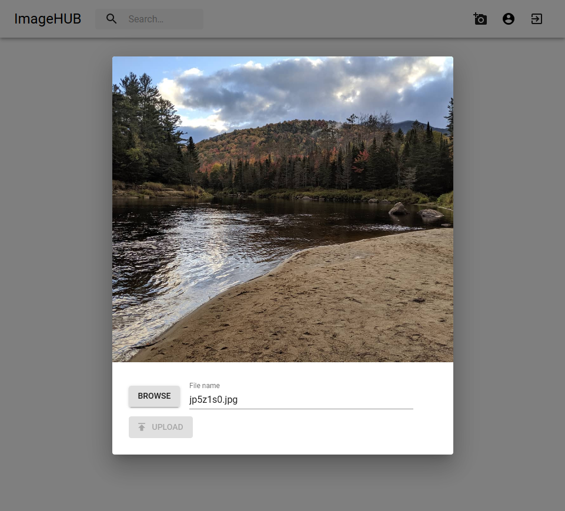
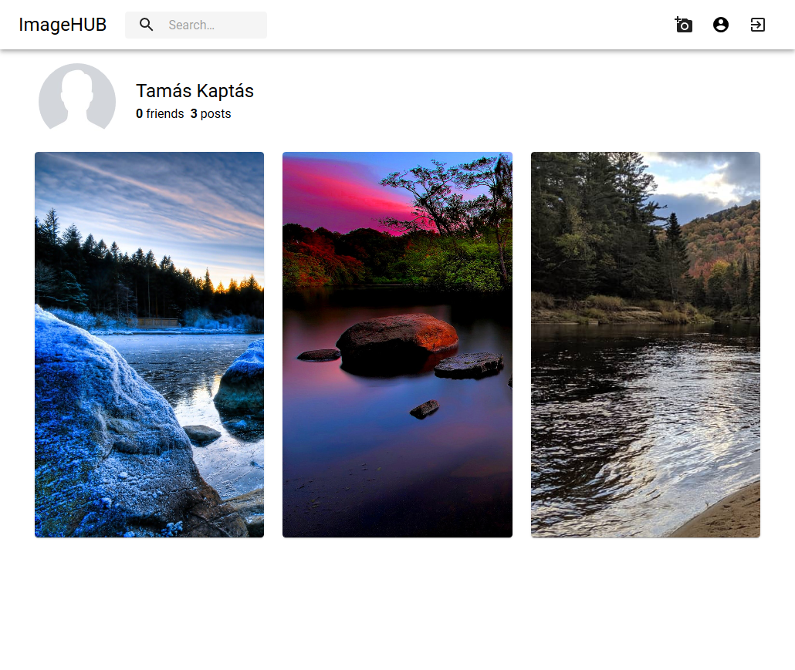

# ImageHUB

ImageHUB is a fictional photo sharing social networking service. It was developed as a class project.
Features:
* Login using Facebook Auth
* Photo uploading
* Image analyzing and automatic tag generation with Microsoft Congnitive Services
* Ability to connect with friend and view their uploaded images

  

